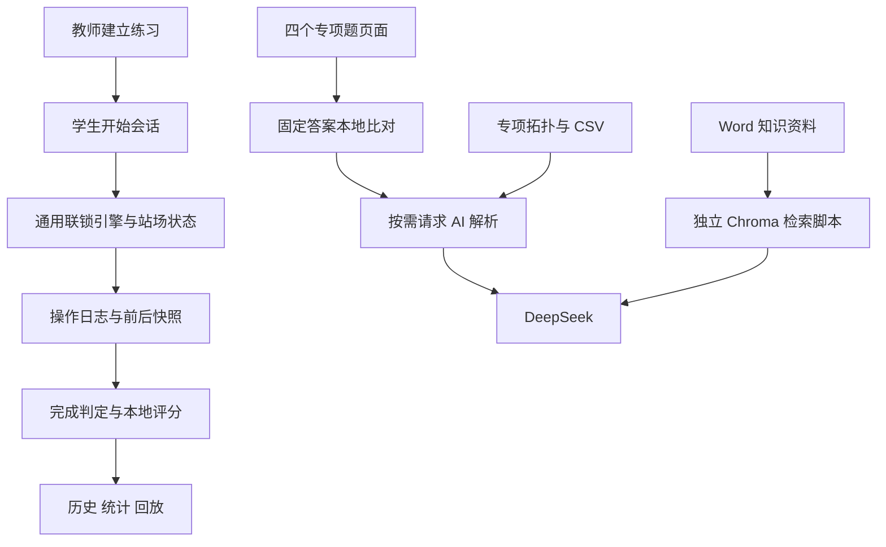

# SRTP 项目内容大纲

> 后续状态更新：已于2026-09-08完成管理员接管与运行修复，详见同目录《接管与使用说明.md》。本大纲下述“静态调查”与问题表保留首次调查基线；其中管理员公开注册、跨角色入口、AI配置分离、解释规则未接入、CSV筛选过宽等问题已在后续修复，不能再视为当前未修复状态。

梳理日期：2026-09-08。项目边界：`D:\GitHub\SRTP`。

**用户最高约束：以“解释学生错误”为主。** 本轮确认仅删除旧生成式资料，其余代码暂留。旧生成规则备份与盲测提示已从原目录删除，恢复副本保存在项目内 `.backups/2026-09-08-error-explanation/`。以下为清理后内容大纲，另保留清理前发现作为现状说明。

本大纲基于当前文件、入口、调用关系、数据与测试源码的静态调查。没有启动服务、执行测试、调用外部 AI、重建向量库或更改业务代码。已校验两个删除文件的恢复备份。目录内已有依赖、数据库和构建产物，不代表本次运行验证通过。专业规则按项目资料描述，未进行铁路规范符合性认证。

## 1. 项目定位与当前结构

项目现有实现是面向铁路信号教学的 **B/S 铁路计算机联锁仿真实训系统**。当前产品主目标已明确为：依据学生答案和站场/联锁表，定位错误、解释原因及后果。通用练习、评分、回放与知识问答等既有内容暂留，不再据其存在推定它们都是当前核心目标。

现有内容分为三条工作线：

1. **通用仿真实训**：Vue 页面 → FastAPI → 联锁引擎 → 数据库状态 → 日志、评分、回放。
2. **专项联锁题**：四个固定专题页面 → 本地标准答案比对 → 用户按需请求 DeepSeek 错误解释。
3. **独立知识问答实验**：Word 等知识资料 → 文本切块与向量检索 → DeepSeek 回答。

第一、二条在 Web 应用中提供入口；第三条以独立 Python 脚本存在，未发现主应用调用知识问答函数。

## 2. 文件夹总览

```text
D:\GitHub\SRTP\
├── README.md                         项目名，尚无完整使用说明
├── AGENTS.md                         项目边界、解释优先与本轮清理范围
├── LICENSE                           MIT 许可证
├── .gitignore                        版本控制忽略规则
├── .git/                             Git 元数据
├── ai_design/                        AI 实验与专业资料
│   ├── ai/
│   │   ├── Must-read document.txt     实验依赖与操作说明
│   │   ├── deepseek.py                基础命令行问答
│   │   ├── knowledge_ai.py            知识库构建、检索与问答
│   │   ├── test.py                    五个问题的交互式实验脚本
│   │   ├── key.env                    AI 配置文件，不在大纲展示内容
│   │   ├── .gitignore
│   │   ├── knowledge/
│   │   │   └── 计算机联锁基础知识.docx
│   │   └── vector_db/                Chroma SQLite 与向量索引二进制文件
│   └── station/
│       ├── station_topology.json     专项站场结构、设备与连通语义
│       ├── signals.txt               信号机清单
│       ├── switches.txt              道岔清单
│       ├── sections.txt              区段清单
│       ├── interlocking_table.csv    19 条进路、14 列参考联锁表
│       ├── interlocking_rules.md     当前解释与错误诊断规则
│       └── student_error_testcases.md 人工编写的错误诊断案例
├── framework/                        Web 应用
│   ├── CLAUDE.md                     原始架构设计、开发阶段与验收目标
│   ├── 启动后端.bat
│   ├── 启动前端.bat
│   ├── package-lock.json             packages 为空的锁文件
│   ├── railway.db                    一处已有业务数据库
│   ├── .claude/settings.local.json    本地工具配置
│   ├── backend/
│   │   ├── main.py                   FastAPI 入口与路由注册
│   │   ├── requirements.txt          后端依赖声明
│   │   ├── .env                      后端配置，不在大纲展示内容
│   │   ├── railway.db                另一处已有业务数据库
│   │   ├── .venv/                    已有 Python 虚拟环境
│   │   ├── app/
│   │   │   ├── api/                  HTTP 接口、认证与专项题逻辑
│   │   │   ├── core/                 配置、数据库、密码与 JWT
│   │   │   ├── models/               ORM 持久化模型
│   │   │   ├── schemas/              请求与响应结构
│   │   │   └── services/             联锁、练习、评分及管理业务
│   │   └── tests/                    8 个测试模块、12 个测试函数
│   └── frontend/
│       ├── package.json / package-lock.json
│       ├── vite.config.js / index.html / .env.development
│       ├── node_modules/             已有前端依赖
│       ├── dist/                     已有构建产物
│       └── src/
│           ├── main.js / App.vue / style.css
│           ├── router/               页面路由与角色守卫
│           ├── layout/               布局、页头、侧边菜单
│           ├── views/                登录、学生、教师、管理员页面
│           ├── components/StationCanvas/
│           ├── store/                Pinia 状态管理
│           ├── api/                  后端接口封装
│           └── utils/                请求与状态文字转换
├── 项目内容大纲.md                    本次生成
├── .planning/2026-09-08-outline/       本次梳理计划、发现与清单
└── .backups/2026-09-08-error-explanation/
    ├── obsolete-generation-materials.zip  已删除资料的恢复副本
    └── manifest.json                  原路径、大小及 SHA-256
```

清点口径：排除 `.git`、依赖目录、Python 缓存、测试缓存、`dist` 和本次文档后，清理前原有主要文件清单共 **148 项**；本次删除其中 2 项，其余保留。未将第三方依赖源码作为项目自有代码逐一阅读。清理前文件路径见 `file-inventory.txt`，清理后清单见 `current-file-inventory.txt`；均位于本次工作记录目录。

## 3. 前端内容大纲

技术声明：Vue 3、Vite 6、Element Plus、Pinia、Vue Router、Axios；版本来自当前 `package.json`，不代表最新上游版本或当前实际安装版本。

### 3.1 页面与角色

| 角色/功能 | 主要文件 | 内容 |
|---|---|---|
| 登录认证 | `views/auth/Login.vue` | 注册、登录及身份进入 |
| 学生首页 | `views/student/Dashboard.vue` | 学生入口和统计 |
| 练习大厅 | `ExerciseLobby.vue` | 浏览可用练习 |
| 练习操作 | `ExerciseWorkbench.vue` | 题目、计时、站场操作与提交 |
| 历史记录 | `ExerciseHistory.vue` | 练习历史与成绩入口 |
| 操作回放 | `ExerciseReplay.vue` | 顺序展示操作及状态快照 |
| 联锁学习 | `InterlockingStudy.vue` | 通用站场与联锁表对照 |
| 基础专项题 | `InterlockingExam.vue` | 东郊至 III 股道接车 |
| 防护道岔题 | `InterlockingExamProtective.vue` | 东郊至 I 股道接车 |
| 带动道岔题 | `InterlockingExamDriven.vue` | 东郊至 4 股道接车 |
| 条件区段题 | `InterlockingExamConditional.vue` | 5 股道向北京方面发车 |
| 教师端 | `views/teacher/` | 首页、练习列表、练习创建与编辑 |
| 管理员端 | `views/admin/` | 用户管理和 AI 配置 |

上述简称文件中，学生页面均在 `framework/frontend/src/views/student/` 下。全前端共 24 个 Vue 文件，包括 16 个页面、3 个布局组件、4 个站场组件和 App 根组件。

### 3.2 站场渲染与状态

- `StationCanvas.vue`：通用站场 SVG 容器，组织设备和交互。
- `SwitchNode.vue`：道岔位置及状态。
- `SignalNode.vue`：信号显示及点击。
- `SectionShape.vue`：轨道区段显示。
- `store/user.js`：用户与登录状态。
- `store/interlocking.js`：普通站场初始化、状态获取及操作。
- `store/exercise.js`：题目、会话和练习过程。
- `store/exerciseInterlocking.js`：携带会话编号提交联锁操作。
- `api/`：auth、admin、exercise、exerciseRuntime、interlocking、interlockingExam、aiScore、statistics、settings 九组接口封装。
- `utils/request.js`、`statusText.js`：请求基础设施与状态中文显示。

四个专项页面拥有各自的题目与交互代码，不应假定它们只是通用联锁引擎的不同配置。

## 4. 后端内容大纲

### 4.1 基础设施

- `main.py`：注册 9 组业务路由与 `/api/health`；启动时调用 ORM 建表。
- `core/config.py`：加载后端 `.env` 和环境变量；声明数据库、JWT、DeepSeek 参数。
- `core/database.py`：SQLAlchemy 引擎、会话和 ORM 基类。
- `core/security.py`、`api/deps.py`：密码、令牌、当前用户与角色权限依赖。
- `requirements.txt`：FastAPI、Uvicorn、SQLAlchemy、Pydantic、JWT、bcrypt、OpenAI SDK、pytest、httpx 等。

### 4.2 接口分组

| 模块 | URL 范围 | 职责 |
|---|---|---|
| `auth.py` | `/api/auth` | 注册、登录、当前用户 |
| `interlocking.py` | `/api/interlocking` | 站场初始化、重置、详情、快照、进路与设备操作 |
| `exercises.py` | `/api/exercises`、`/api/exercise-sessions` | 出题、大厅、会话开始/结束、历史和回放 |
| `exercise_runtime.py` | `/api/exercise-runtime` | 会话操作包装、日志与完成判定 |
| `ai_scores.py` | `/api/ai-scores` | 生成和查询练习评分 |
| `statistics.py` | `/api/statistics` | 学生个人与教师概览统计 |
| `admin.py` | `/api/admin` | 用户管理 |
| `settings.py` | `/api/settings` | AI 配置保存与连接测试 |
| `interlocking_exam.py` | `/api/exam/submit`、`/api/exam/ai-explain` | 固定专项题判定与按需 AI 解析 |

### 4.3 业务服务

**联锁服务 `services/interlocking/`**

- `seed_data.py`：通用简化站场、绘图几何和 22 条预置进路。
- `seed_service.py`：种子数据写入、运行状态重置。
- `repository.py`：站场与设备状态读写、进路状态及快照。
- `rules.py`：区段空闲、信号关闭、敌对进路及资源归属检查。
- `engine.py`：办理、取消、人工解锁、单操道岔及区段占用处理。
- `constants.py`：状态常量。

办理流程为查找预置进路 → 检查条件 → 调整并锁闭道岔/区段 → 建立锁闭进路 → 开放始端信号。区段占用更新会关闭相关信号；取消与人工解锁执行当前代码中的资源释放。它是简化教学引擎，不能仅凭类注释推断已实现完整现场联锁时序。

**练习服务 `services/exercise/`**

- `exercise_service.py`：题目管理。
- `session_service.py`：开始、结束、超时、历史与日志查询。
- `runtime_service.py`：会话校验 → 调用联锁引擎 → 捕获前后快照 → 写日志 → 判定完成。
- `logging_service.py`：日志顺序及操作计数。
- `completion_service.py`：目标进路完成判断、结束会话与触发评分。

**其他服务**

- `ai_scoring/scoring_service.py`：本地规则评分、评语与结果持久化；当前未真正调用 DeepSeek。
- `statistics_service.py`：成绩统计。
- `user_service.py`、`admin_service.py`：账户与管理业务。

### 4.4 数据模型

| 分组 | ORM 模型 |
|---|---|
| 账户 | User |
| 静态站场 | Station、Signal、Switch、Section、InterlockingTable |
| 运行状态 | DeviceState、RouteState |
| 教学记录 | Exercise、ExerciseSession、OperationLog、AiScore |

题目关联教师与车站，会话关联学生与题目，操作日志和评分关联会话。设备和进路运行状态主要按 `station_id` 关联，当前模型没有会话级状态隔离字段。

## 5. AI 与专业资料内容大纲

### 5.1 三种不同的“AI”职责

| 位置 | 实际行为 | 当前边界 |
|---|---|---|
| 常规练习评分 | 正确性最高 40、效率最高 30、规范性最高 30，本地公式生成结果 | 配置真密钥仍执行 `_local_score`，返回模式可能是 `deepseek_placeholder` |
| 专项题错误解释 | 程序先比对四套固定答案；点击解析后调用外部模型 | 当前代码指定 `deepseek-v4-flash`，未验证服务可用性 |
| 独立知识问答 | Chroma 检索本地资料，将相关段落发送给模型 | 尚未发现接入 Web 主流程 |

### 5.2 知识问答实验

`knowledge_ai.py` 支持 txt、md、pdf、docx 加载，按 500 字符块、100 字符重叠切分；使用 `shibing624/text2vec-base-chinese` 嵌入模型和 Chroma 持久化。默认检索 7 块，按距离阈值 0.8 筛选，未命中时返回无法回答。

“只依据资料回答”是检索过滤与提示词约束，不能当成模型绝不使用自身知识的证明。索引存在，但本次未确认索引与 Word 最新内容一致，也未加载嵌入模型。

Word 正文已提取阅读，包含 7 个主题段落：计算机联锁概念与指标、三层结构、相对继电联锁的特点、典型系统结构与通信、软件和静动态数据、冗余与故障安全、典型系统举例。文中指标和产品描述仅作为资料内容识别，未作为本项目已达到的性能指标。

`test.py` 是运行后会实际提问的实验脚本，包含资料内问题、模糊问题和天气等资料外问题，不是已有通过记录的自动断言测试。

### 5.3 站场资料

专项拓扑包含 **5 股道、15 架信号机、8 组道岔、18 个区段**。8 组道岔含双动组合，不能解读为 8 台独立道岔设备。资料定义北京/东郊方向、终端按钮、股道能力、交叉渡线及条件连通等语义。

`interlocking_table.csv` 实际按 GBK 可正确解码，为 **19 行进路记录、14 列**，包括方面、进路内容/方式、按钮、方向道岔、信号显示、表示器、道岔、敌对信号、区段、迎面列车/调车进路、其他联锁与进路号码。

当前解释规则文档的主题：

1. 面向学生的解释语言要求。
2. 联锁基础概念、输入资料和 14 列表结构。
3. 复原走行路径。
4. 道岔、敌对信号、轨道区段和按钮的原理及错误诊断。
5. 其余列、进路方式与变通按钮边界。
6. 统一诊断流程、错误分类、数据格式及历史经验。

旧生成规则与生成式盲测提示已移除，不再作为有效项目资料；压缩备份仅用于恢复。当前解释规则、参考联锁表和学生错误诊断案例继续保留。

## 6. 两套站场不能混为一套

| 对比项 | 通用仿真 | 专项联锁题 |
|---|---|---|
| 数据源 | 后端 `seed_data.py` → 数据库 | `ai_design/station` + API 内固定答案 + 页面代码 |
| 股道 | I、II、3、4 | 5、III、I、II、4 |
| 信号 | X、S、D1–D10，共 12 架 | XD、X、D 系列、S 系列等，共 15 架 |
| 道岔 | 1#–10#，10 个单动定义 | 1/3、5/7 等 8 组单动/双动定义 |
| 区段 | IAG、1DG–10DG，共 11 个 | 18 个，含复合区段与股道区段 |
| 进路 | 22 条种子记录 | 19 条 CSV 参考记录；当前考核 4 个专题 |
| 主要结果 | 运行状态、会话、日志、评分、回放 | 选择项对错和错误解释 |

两套资料虽都出现“下行咽喉标准站”，设备与结构并不相同。修改某套数据不会自动同步另一套。

## 7. 关键调用关系



图中没有将规则 Markdown 或 Chroma 连到专项解析：当前 `_load_rules()` 只有定义，未发现调用；专项解析直接组合拓扑、CSV 文字、题目条件及内置提示词。

## 8. 已确认差异与待验证事项

| 项目 | 证据与影响 |
|---|---|
| 设计文档不是完成报告 | `CLAUDE.md` 中的勾选、预计工时、示例和验收标准不能证明已通过验收 |
| 常规 AI 评分尚是本地实现 | `generate_ai_score()` 直接调用 `_local_score()`，不能宣传为模型已评审每次练习 |
| AI 配置分两处 | 设置页修改后端 `.env`；专项解析直接读取 `ai_design/ai/key.env` 且硬编码模型和地址，因此管理页配置不会自动统一两者 |
| 解释规则尚未直接接入调用 | `_load_rules()` 未被实际解析函数调用；改 Markdown 不会直接改变当前提示词 |
| CSV 选择条件过宽 | `_load_interlocking_table_row()` 用整行包含“方面”和“I/III/4/5”等词筛选，可能混入其他股道或接发方向的记录 |
| 会话状态隔离不足 | 开始会话会重置该车站运行状态；DeviceState/RouteState 按车站存储。推断多个学生共用车站时可能互相干扰，尚未做并发复现 |
| 注册接口接受管理员角色 | 注册接口无登录依赖，UserRegister 允许 admin，服务直接保存角色；若按当前逻辑开放访问，存在自行注册管理员的权限风险 |
| 两处业务数据库 | `framework/railway.db` 和 `framework/backend/railway.db` 同时存在。默认数据库 URL 使用相对路径；实际选用哪份需结合运行配置与启动目录确认 |
| 旧生成资料已清理 | 删除前盲测提示仍引用旧规则 §1–§16 和“约17条”，与当前解释目标及19条参考记录不一致；本轮已删除该提示及生成规则备份 |
| 案例数量说明不一致 | 错误案例正文编号为 A1–A4、B1–B4、C1–C3、D1，共12项；末尾自述13/13，未见相应自动执行报告 |
| 专项成绩尚未见持久化 | 专项提交/解释函数返回比对结果和说明，虽注入数据库依赖但未见在这两条函数中写入练习会话/成绩 |
| 已有环境不等于当前可用 | .venv、node_modules、dist 均存在，但本次没有启动或构建验证 |

这份大纲是结构与实现现状调查，不是完整代码审计。上表的代码事实已静态核对；并发影响、部署暴露面、专业正确性及模型输出质量仍需对应测试。

## 9. 测试与运行材料

后端 8 个测试模块、12 个 `test_` 函数覆盖：联锁引擎 5 项，以及联锁 API、练习 API、日志、回放、评分、统计、管理员 API 各 1 项。测试夹具使用临时 SQLite。

未发现专项题四套答案或 AI 解释的专门 pytest 测试模块。测试源码存在，不代表本次执行成功。

启动后端脚本切换到 `backend`，调用该目录 `.venv\Scripts\python.exe`，以 8000 端口启动 Uvicorn；前端脚本切换到 `frontend` 后执行 `npm run dev`，Vite 配置端口 5173，并将 `/api` 代理到后端 8000。本次仅阅读脚本，未执行。

后续若进行运行验证，工作目录、测试临时目录、日志、数据库副本和构建输出均应显式限制在本项目根目录内；尤其注意 pytest 默认临时目录及模型默认下载缓存可能落在项目外。

## 10. 建议阅读顺序

1. 本大纲：先了解三条工作线和两套站场。
2. `framework/CLAUDE.md`：了解目标，结合现状差异阅读。
3. `framework/frontend/src/router/index.js` 与后端 `main.py`：把页面和接口对应起来。
4. 后端 `services/interlocking/` → `services/exercise/` → `models/`：理解操作、状态和日志。
5. `ai_design/station/` → 后端 `api/interlocking_exam.py` → 前端四个专项页：理解考核和解释。
6. `ai_design/ai/knowledge_ai.py` 与 Word：了解独立知识检索实验。
7. 后端 `tests/`：理解已有测试范围，再安排实际验证。

本次新增本大纲、`AGENTS.md`、项目内调查记录与恢复备份；删除两个旧生成式资料文件。原有代码、密钥配置、数据库、向量库与构建产物均未修改。
